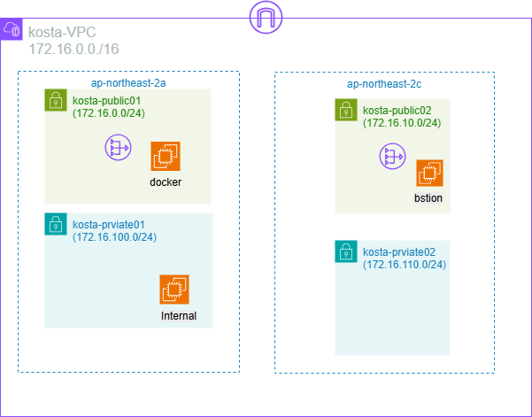

# Terraform 구성 가이드

이 예제는 `terraform.png`의 아키텍처를 기준으로 AWS 서울 리전(`ap-northeast-2`)에 VPC, 서브넷, 라우팅, 보안 그룹, EC2 인스턴스를 구성하는 Terraform 실습입니다.

## 아키텍처 개요



- VPC 이름: `kosta-VPC`
- VPC CIDR: `172.16.0.0/16`
- 가용 영역: `ap-northeast-2a`, `ap-northeast-2c`
- Public Subnet 2개
- Private Subnet 2개
- Public EC2
  - Docker 서버
  - Bastion 서버
- Private EC2
  - Internal 서버
- SSH 키쌍
  - 키 이름: `kosta`
  - Private Key 저장 위치: `~/.ssh/kosta.pem`

## 네트워크 구성

| 구분 | 이름 | CIDR | AZ | 용도 |
| --- | --- | --- | --- | --- |
| VPC | `kosta-VPC` | `172.16.0.0/16` | - | 전체 네트워크 영역 |
| Public Subnet | `kosta-public01` | `172.16.0.0/24` | `ap-northeast-2a` | Docker 서버 배치 |
| Public Subnet | `kosta-public02` | `172.16.10.0/24` | `ap-northeast-2c` | Bastion 서버 배치 |
| Private Subnet | `kosta-private01` | `172.16.100.0/24` | `ap-northeast-2a` | Internal 서버 배치 |
| Private Subnet | `kosta-private02` | `172.16.110.0/24` | `ap-northeast-2c` | 내부 확장용 |

## EC2 구성

| 이름 | 위치 | 역할 |
| --- | --- | --- |
| `docker` | `kosta-public01` | Docker 실행용 Public 서버 |
| `bastion` | `kosta-public02` | Private 서버 접속용 Bastion 서버 |
| `Internal` | `kosta-private01` | 외부에서 직접 접근하지 않는 내부 서버 |

모든 EC2 인스턴스는 동일한 SSH 키쌍인 `kosta`를 사용하도록 `key_name`을 설정합니다.
모든 EC2 인스턴스의 인스턴스 타입은 `t3.medium`을 사용하고, AMI는 Amazon Linux 2023을 사용합니다.

| 항목 | 값 |
| --- | --- |
| Instance Type | `t3.medium` |
| AMI | Amazon Linux 2023 |
| SSH Key Pair | `kosta` |

## 주요 Terraform 리소스

Terraform으로 다음 리소스를 생성합니다.

- `aws_vpc`
- `aws_subnet`
- `aws_internet_gateway`
- `aws_route_table`
- `aws_route_table_association`
- `aws_security_group`
- `aws_instance`
- `tls_private_key`
- `aws_key_pair`
- `local_file`
- `data.aws_ami`

## AMI 및 EC2 공통 설정

Amazon Linux 2023 AMI는 리전마다 AMI ID가 다를 수 있으므로, Terraform의 `aws_ami` 데이터 소스를 사용해 최신 Amazon Linux 2023 AMI를 조회합니다.

```hcl
data "aws_ami" "amazon_linux_2023" {
  most_recent = true
  owners      = ["amazon"]

  filter {
    name   = "name"
    values = ["al2023-ami-2023.*-x86_64"]
  }

  filter {
    name   = "architecture"
    values = ["x86_64"]
  }

  filter {
    name   = "virtualization-type"
    values = ["hvm"]
  }
}
```

모든 EC2 인스턴스에는 공통으로 Amazon Linux 2023 AMI와 `t3.medium` 타입을 적용합니다.

```hcl
resource "aws_instance" "bastion" {
  ami           = data.aws_ami.amazon_linux_2023.id
  instance_type = "t3.medium"
  key_name      = aws_key_pair.kosta.key_name
}

resource "aws_instance" "docker" {
  ami           = data.aws_ami.amazon_linux_2023.id
  instance_type = "t3.medium"
  key_name      = aws_key_pair.kosta.key_name

  user_data = <<-EOF
              #!/bin/bash
              sudo dnf install -y docker
              sudo systemctl enable docker --now
              sudo usermod -aG docker ec2-user
              EOF
}

resource "aws_instance" "internal" {
  ami           = data.aws_ami.amazon_linux_2023.id
  instance_type = "t3.medium"
  key_name      = aws_key_pair.kosta.key_name
}
```

Docker 인스턴스는 User Data를 사용해 부팅 시 Docker를 설치하고, Docker 서비스를 자동 시작하도록 설정합니다. 또한 `ec2-user`를 `docker` 그룹에 추가해 Docker 명령을 사용할 수 있도록 구성합니다.

## SSH 키쌍 구성

Terraform에서 `kosta` 이름의 SSH 키쌍을 생성하고, 생성된 Private Key를 로컬 `~/.ssh/kosta.pem` 파일로 저장합니다.

```hcl
resource "tls_private_key" "kosta" {
  algorithm = "RSA"
  rsa_bits  = 4096
}

resource "aws_key_pair" "kosta" {
  key_name   = "kosta"
  public_key = tls_private_key.kosta.public_key_openssh
}

resource "local_file" "kosta_private_key" {
  filename        = pathexpand("~/.ssh/kosta.pem")
  content         = tls_private_key.kosta.private_key_pem
  file_permission = "0400"
}
```

EC2 인스턴스에는 공통으로 `aws_key_pair.kosta.key_name`을 적용합니다.
이미 위 EC2 예시처럼 AMI, 인스턴스 타입, 키쌍 설정을 함께 지정합니다.

```hcl
resource "aws_instance" "bastion" {
  # ...
  key_name = aws_key_pair.kosta.key_name
}

resource "aws_instance" "docker" {
  # ...
  key_name = aws_key_pair.kosta.key_name
}

resource "aws_instance" "internal" {
  # ...
  key_name = aws_key_pair.kosta.key_name
}
```

Private Key 파일은 Terraform Apply 이후 로컬 사용자 홈 디렉터리의 `.ssh` 폴더에 생성됩니다.

```text
~/.ssh/kosta.pem
```

## 라우팅 구성

### Public Subnet

Public Subnet은 Internet Gateway를 통해 외부 인터넷과 통신합니다.

```text
0.0.0.0/0 -> Internet Gateway
```

### Private Subnet

Private Subnet은 외부에서 직접 접근하지 않습니다. Internal 서버는 Bastion 서버를 통해 접속하는 구조로 구성합니다.

인터넷 업데이트나 패키지 설치가 필요한 경우에는 NAT Gateway 또는 NAT Instance 구성이 추가로 필요합니다.

## 보안 그룹 예시

### Bastion Security Group

- 인바운드
  - SSH `22`: 관리자 IP에서만 허용
- 아웃바운드
  - 전체 허용

### Docker Security Group

- 인바운드
  - SSH `22`: 관리자 IP에서만 허용
  - 서비스 포트: 실습 목적에 따라 허용
- 아웃바운드
  - 전체 허용

### Internal Security Group

- 인바운드
  - SSH `22`: Bastion Security Group에서만 허용
- 아웃바운드
  - 전체 허용

## 추천 파일 구조

```text
.
├── README.md
├── terraform.png
├── provider.tf
├── variables.tf
├── vpc.tf
├── subnet.tf
├── route.tf
├── security_group.tf
├── key_pair.tf
├── ec2.tf
├── outputs.tf
└── terraform.tfvars
```

## 실행 방법

### 1. Terraform 초기화

```bash
terraform init
```

### 2. 실행 계획 확인

```bash
terraform plan
```

### 3. 인프라 생성

```bash
terraform apply
```

### 4. 생성 리소스 확인

```bash
terraform state list
```

### 5. 인프라 삭제

```bash
terraform destroy
```

## 접속 흐름

### Bastion 서버 접속

```bash
ssh -i ~/.ssh/kosta.pem ec2-user@<bastion-public-ip>
```

### Internal 서버 접속

Bastion 서버에 접속한 뒤 Private IP를 이용해 Internal 서버로 접속합니다.

```bash
ssh -i ~/.ssh/kosta.pem ec2-user@<internal-private-ip>
```

## 검증 항목

- VPC CIDR가 `172.16.0.0/16`으로 생성되었는지 확인
- 4개 서브넷이 각각 올바른 CIDR와 AZ에 생성되었는지 확인
- Public Subnet이 Internet Gateway와 연결된 Route Table을 사용하는지 확인
- Docker 서버와 Bastion 서버에 Public IP가 할당되었는지 확인
- Internal 서버가 Private Subnet에 생성되었는지 확인
- `kosta` 키쌍이 생성되었고 모든 EC2에 적용되었는지 확인
- Private Key가 로컬 `~/.ssh/kosta.pem`에 저장되었는지 확인
- Internal 서버의 SSH 접근이 Bastion 서버에서만 가능한지 확인

## 참고 사항

- AWS 리전은 서울 리전(`ap-northeast-2`)을 기준으로 합니다.
- SSH 접근 CIDR는 보안을 위해 `0.0.0.0/0` 대신 본인 공인 IP로 제한하는 것을 권장합니다.
- Private Subnet의 인스턴스가 인터넷으로 나가야 한다면 NAT Gateway 구성을 추가해야 합니다.
