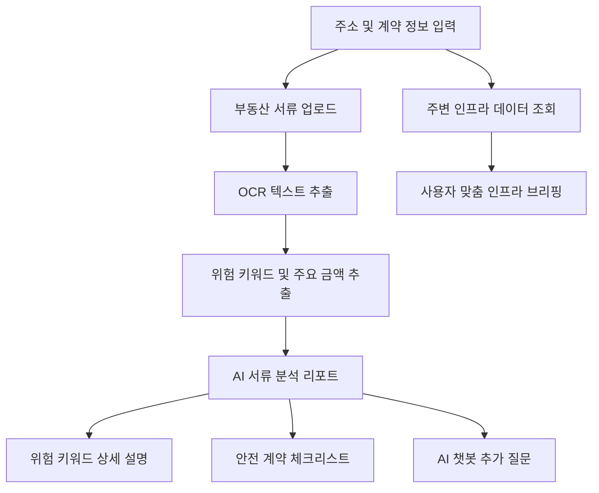
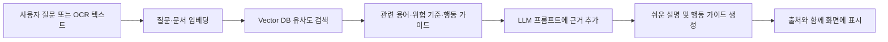
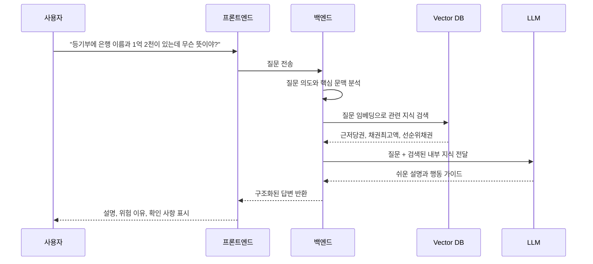
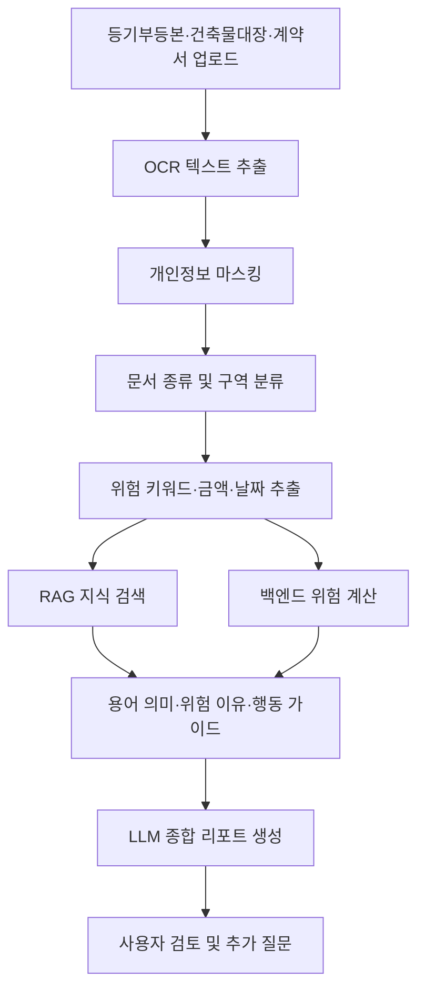
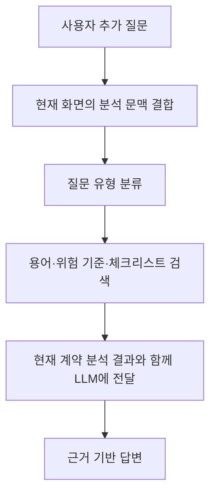
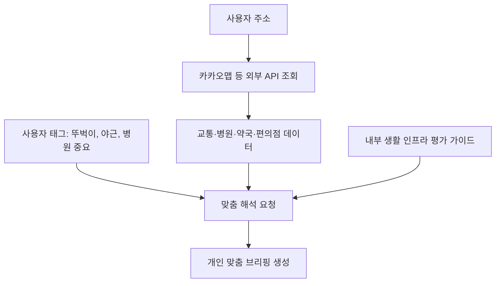
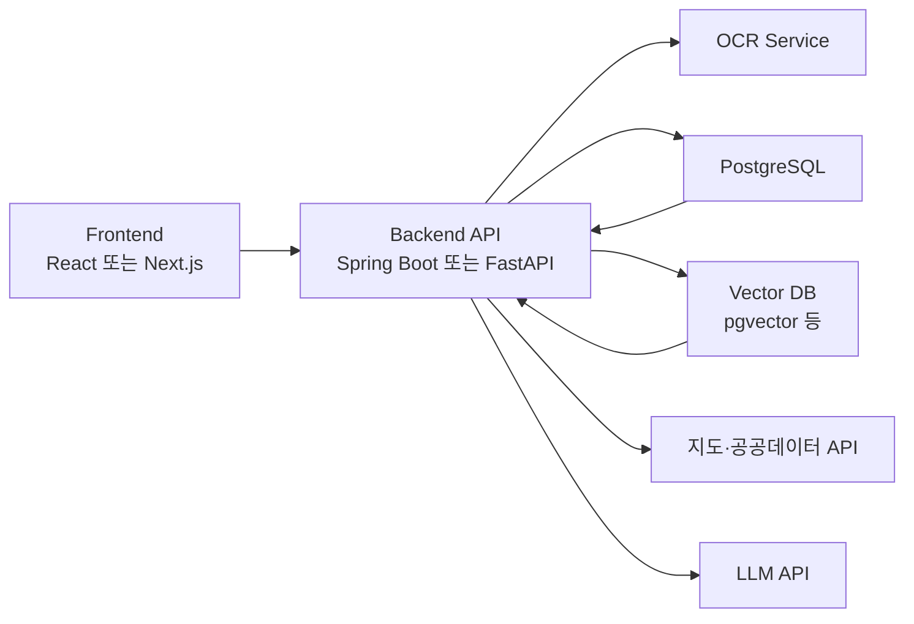

# ZIPT RAG 적용 및 Stitch 프로토타입 분석

## 1. 문서 목적

이 문서는 ZIPT 프로젝트에서 담당하고 있는 다음 기능을 하나의 서비스 흐름으로 정리하기 위해 작성한다.

- AI 부동산 서류 분석 및 위험 키워드 탐지
- 쉬운 금융·부동산 용어 사전
- 부동산 질문을 받는 간단한 챗봇
- 계약할 집 주변의 생활 인프라 정보 제공

또한 Google Stitch로 제작한 프로토타입 화면 중 핵심 화면을 선별하고, 각 화면에 RAG를 어떻게 적용할지 정리한다.

---

## 2. 프로토타입에서 확인된 주요 기능

Stitch export 폴더에는 약 90개 이상의 화면 시안이 있으며, 같은 기능의 디자인 변형과 중복 페이지가 포함되어 있다. 화면을 기능 기준으로 분류하면 다음과 같다.

### 2.1 핵심 기능 화면

| 기능 | 대표 화면 폴더 | 주요 내용 |
|---|---|---|
| 부동산 용어 사전 | `zipt_16`, `zipt_zip_6` | 용어 검색, 카테고리 필터, 쉬운 설명 |
| 문맥 기반 용어 설명 | `zipt_ai_7`, `zipt_ai_11` | 계약서에서 발견된 용어의 상세 설명과 행동 가이드 |
| 서류 분석 리포트 | `zipt_ai_6`, `zipt_ai_9` | OCR 분석, 위험 키워드, 보증보험 가능성, 종합 리포트 |
| 계약 조항 분석 | `zipt_ai_5`, `_5` | 특약이나 계약 문장의 위험도와 수정 가이드 |
| 안전 계약 체크리스트 | `zipt_40` | 서류 확인, 현장 점검, 법적 보호 절차 |
| 생활 인프라 브리핑 | `zipt_19`, `zipt_ai_3` | 지하철, 병원, 편의시설, 도보 거리 |
| 지역 안전 정보 | `zipt_31` | 범죄 및 생활 안전 데이터 요약 |
| AI 챗봇·상담 | `zipt_ai_1_1_1~3` | 분석 결과에 대한 추가 질문과 답변 |
| 협상 가이드 | `ai_zipt_1~6` | 위험 조항의 대체 문구와 협상 문장 |

### 2.2 후순위 기능

다음 기능들은 완성도 높은 시안이 있지만, 1차 MVP에서는 제외하거나 후순위로 두는 것이 적절하다.

- 커뮤니티 및 게시글
- 전문가 프로필과 1:1 상담
- Pro 구독
- 계약 협상 시뮬레이터
- 부동산 매물 비교
- 대출 사전 승인

핵심 기능이 충분히 구현되기 전에 이 기능들을 모두 포함하면 프로젝트의 중심이 흐려지고 개발 범위가 커질 수 있다.

---

## 3. 추천 사용자 흐름

각 기능을 별도의 서비스처럼 제공하기보다, 사용자가 계약할 집을 검토하는 하나의 흐름으로 연결한다.



### 사용자 경험 예시

1. 사용자가 계약할 집의 주소와 보증금을 입력한다.
2. 등기부등본, 건축물대장 또는 계약서를 업로드한다.
3. 시스템이 OCR로 문서의 텍스트를 추출한다.
4. `근저당권`, `가압류`, `신탁`, `위반건축물` 등의 위험 신호를 찾는다.
5. 백엔드가 보증금, 채권최고액, 주택 시세 등을 이용해 위험 수치를 계산한다.
6. RAG가 내부 지식 데이터에서 발견된 용어의 의미와 대응 방법을 검색한다.
7. AI가 쉬운 말로 종합 리포트를 작성한다.
8. 사용자가 모르는 용어를 누르면 용어 상세 설명이 열린다.
9. 사용자는 챗봇에 분석 결과에 대한 추가 질문을 할 수 있다.
10. 별도 탭에서 주변 교통·병원·편의시설 정보를 확인한다.

---

## 4. RAG의 역할

RAG는 내부 용어 사전 자체를 의미하지 않는다. 내부 용어 사전과 위험 키워드 사전을 **AI가 검색할 수 있는 근거 데이터 저장소**로 사용하는 방식이다.

```text
R: Retrieval
   사용자 질문이나 서류 내용과 관련된 내부 지식을 검색

A: Augmented
   검색된 지식을 AI 프롬프트에 참고 자료로 추가

G: Generation
   AI가 검색된 근거를 이용해 쉬운 답변이나 리포트를 생성
```

### 전체 RAG 처리 과정



---

## 5. 쉬운 금융·부동산 용어 사전 RAG

### 5.1 기본 데이터 흐름



### 5.2 일반 DB 검색과 RAG 검색의 차이

일반 검색은 사용자가 정확한 용어를 입력하는 경우에 적합하다.

```text
검색어: 근저당권
결과: 근저당권 항목 반환
```

RAG 검색은 사용자가 용어를 몰라도 문장의 의미를 이용해 관련 지식을 찾을 수 있다.

```text
질문: 등기부에 은행 이름과 큰 금액이 적혀 있는데 위험한가요?

검색 후보:
- 근저당권
- 채권최고액
- 선순위채권
- 전세보증보험
```

따라서 실제 서비스에서는 다음과 같이 혼합하는 것이 좋다.

- 정확한 용어 검색: 관계형 DB 또는 검색 인덱스 사용
- 자연어 질문: Vector DB를 통한 의미 기반 검색 사용
- 최종 설명: 검색 결과를 LLM이 사용자 상황에 맞게 조합

### 5.3 화면 출력 구조

용어 상세 화면은 다음 정보를 제공한다.

```text
[용어]
근저당권

[한 줄 설명]
집주인이 집을 담보로 돈을 빌렸다는 뜻이에요.

[왜 중요한가요?]
집이 경매로 넘어가면 은행이 세입자보다 먼저 돈을 가져갈 수 있어요.

[현재 문서에서는]
채권최고액 1억 2천만 원의 근저당권이 확인됐어요.

[계약 전 확인할 것]
- 채권최고액과 보증금 합산
- 집값 대비 부채 비율 확인
- 전세보증보험 가입 가능 여부 확인

[관련 용어]
채권최고액 / 선순위채권 / 전세보증보험

[근거]
내부 용어 사전 및 등록된 공식 자료
```

---

## 6. 부동산 서류 위험 키워드 분석 RAG

용어 사전 RAG와 기본 구조는 같지만 입력 데이터와 처리 목적이 다르다.

| 구분 | 용어 사전 | 서류 위험 분석 |
|---|---|---|
| 입력 | 사용자 질문 또는 용어 클릭 | OCR로 추출한 서류 텍스트 |
| 검색 대상 | 용어 설명 | 위험 키워드, 판단 기준, 행동 가이드 |
| 출력 | 쉬운 용어 설명 | 위험 분석 리포트 |
| 계산 | 거의 없음 | 보증금, 채권, 시세 등을 이용한 계산 필요 |

### 6.1 처리 흐름



### 6.2 각 기술의 역할 분리

#### OCR

- 문서 이미지나 PDF에서 텍스트를 추출한다.
- 주민등록번호, 이름 등 개인정보는 마스킹한다.

#### AI 또는 문서 파서

- 문서에서 위험 키워드, 금액, 날짜, 소유자 변경 등을 추출한다.
- 결과는 JSON으로 반환한다.

```json
{
  "document_type": "등기부등본",
  "detected_terms": ["근저당권", "채권최고액"],
  "amounts": {
    "채권최고액": 120000000
  },
  "ownership_change_count": 1
}
```

#### RAG

- 추출된 용어가 무슨 의미인지 검색한다.
- 왜 임차인에게 위험할 수 있는지 검색한다.
- 사용자가 다음에 무엇을 확인해야 하는지 검색한다.
- 답변에 사용할 공식 근거와 내부 가이드를 검색한다.

#### 백엔드 계산 로직

- 부채 비율과 같은 수치 계산을 수행한다.
- HUG 가입 가능성 판단에 필요한 정형 조건을 검사한다.
- 위험 점수를 산출한다.

```text
부채 비율 =
(선순위 채권 + 사용자 보증금) / 주택 인정 가격 × 100
```

중요한 수치 계산을 LLM에 맡기지 않고 백엔드 코드로 수행해야 결과의 일관성과 정확도를 확보할 수 있다.

#### LLM

- OCR 결과, 백엔드 계산 결과, RAG 검색 결과를 조합한다.
- 법률 초보자가 이해할 수 있는 리포트로 변환한다.
- 확정할 수 없는 내용은 단정하지 않고 추가 확인이 필요하다고 표시한다.

---

## 7. 챗봇의 위치

챗봇은 별도 기능으로 분리하기보다 서류 분석과 용어 사전을 연결하는 인터페이스로 사용하는 것이 좋다.

### 추천 진입 위치

- 서류 분석 리포트 하단의 `분석 결과 질문하기`
- 위험 키워드 상세 화면의 `이 용어에 대해 질문하기`
- 계약 체크리스트의 `왜 확인해야 하나요?`
- 인프라 화면의 `내 생활패턴에 맞는지 질문하기`

### 챗봇 질문 처리 과정



예를 들어 사용자가 서류 분석 화면에서 다음과 같이 질문할 수 있다.

```text
이 집에 근저당권이 있어도 계약해도 돼?
```

챗봇은 일반적인 근저당권 설명만 하는 것이 아니라 다음 정보를 함께 사용해야 한다.

- 현재 문서에서 추출된 채권최고액
- 사용자가 입력한 보증금
- 조회된 주택 가격
- 계산된 부채 비율
- 내부 위험 기준과 행동 가이드

---

## 8. 주변 인프라 정보와 RAG

주변 시설을 찾는 작업 자체는 RAG가 아니라 지도 API와 공공데이터 API의 역할이다.

```text
주소
→ 위도·경도 변환
→ 반경 500m~1km 시설 조회
→ 거리 및 도보 시간 계산
```

RAG는 조회된 데이터를 사용자의 생활 조건에 맞게 해석할 때 사용할 수 있다.



### 역할 구분

- 외부 API: 실제 시설명, 좌표, 거리, 운영 정보
- 백엔드: 거리 계산, 시설 개수 집계, 점수 계산
- RAG: 생활 유형별 평가 기준과 설명 자료 검색
- LLM: 사용자에게 자연스러운 맞춤 브리핑 제공

---

## 9. 내부 지식 데이터 구조

### 9.1 용어 사전 데이터

```json
{
  "term_id": "TERM-001",
  "term": "근저당권",
  "aliases": ["근저당", "담보 설정"],
  "category": "등기부등본",
  "easy_definition": "집주인이 집을 담보로 돈을 빌렸다는 뜻이에요.",
  "legal_definition": "계속적인 거래에서 발생할 채권을 일정한 한도까지 담보하는 저당권입니다.",
  "why_important": "경매 시 세입자의 보증금보다 먼저 변제될 수 있습니다.",
  "action_guide": [
    "채권최고액을 확인하세요.",
    "보증금과 채권최고액을 합산하세요.",
    "주택 가격 대비 비율을 확인하세요."
  ],
  "related_terms": ["채권최고액", "선순위채권", "전세보증보험"],
  "source_ids": ["SRC-001"]
}
```

### 9.2 위험 키워드 데이터

```json
{
  "risk_id": "RISK-001",
  "keyword": "가압류",
  "document_types": ["등기부등본"],
  "section": "갑구",
  "default_risk_level": "HIGH",
  "risk_reason": "소유자의 채무 문제로 부동산 처분이 제한된 상태일 수 있습니다.",
  "detection_patterns": ["가압류", "가압류등기"],
  "required_checks": [
    "가압류 채권자 확인",
    "청구 금액 확인",
    "말소 여부 확인"
  ],
  "action_guide": "말소 확인 전 계약 진행을 보류하고 전문가 검토를 권장합니다.",
  "source_ids": ["SRC-002"]
}
```

### 9.3 출처 데이터

```json
{
  "source_id": "SRC-001",
  "organization": "공식 기관명",
  "document_title": "참고 문서 제목",
  "source_url": "https://example.com",
  "published_at": "YYYY-MM-DD",
  "reviewed_at": "YYYY-MM-DD",
  "effective_from": "YYYY-MM-DD",
  "status": "ACTIVE"
}
```

법률과 보증 기준은 변경될 수 있으므로 출처, 검토일, 적용 시작일을 반드시 저장하는 것이 좋다.

---

## 10. 일반 DB와 Vector DB의 역할

모든 데이터를 Vector DB에만 저장할 필요는 없다.

### 관계형 DB에 저장할 데이터

- 용어 원본 데이터
- 카테고리
- 위험 등급
- 행동 가이드
- 관련 용어 관계
- 출처와 검수 이력
- 사용자 분석 결과
- 수치 계산 결과

### Vector DB에 저장할 데이터

- 용어의 쉬운 설명
- 위험 상황 설명
- 행동 가이드 문장
- 공식 자료를 적절한 크기로 나눈 문서 조각
- 계약 조항 사례와 해설

### 추천 검색 방식

```text
정확한 용어 검색
→ 관계형 DB 키워드 검색

자연어 질문
→ Vector DB 의미 검색

최종 후보 정렬
→ 키워드 일치도 + 벡터 유사도 + 문서 종류 + 위험 중요도
```

---

## 11. 추천 시스템 구성



PostgreSQL을 사용할 예정이라면 별도의 Vector DB를 추가하기보다 `pgvector`로 시작하면 시스템 복잡도를 줄일 수 있다.

---

## 12. 추천 API 구조

```text
POST /api/documents/analyze
부동산 서류 업로드 및 분석

GET /api/analyses/{analysisId}
서류 분석 결과 조회

GET /api/terms
용어 목록과 필터 조회

GET /api/terms/{termId}
용어 상세 조회

POST /api/terms/search
자연어 기반 용어 검색

POST /api/chat
현재 분석 문맥을 포함한 추가 질문

GET /api/properties/{propertyId}/infrastructure
주변 인프라 조회

POST /api/properties/{propertyId}/infrastructure/briefing
사용자 성향 기반 인프라 브리핑 생성
```

---

## 13. 화면 정리 제안

### 1차 MVP 필수 화면

1. 메인 또는 분석 시작 화면
2. 주소·보증금 입력 화면
3. 서류 업로드 화면
4. 분석 진행 화면
5. AI 서류 분석 리포트
6. 위험 키워드 상세 설명
7. 부동산 용어 사전
8. 안전 계약 체크리스트
9. 주변 인프라 브리핑
10. 분석 문맥 기반 챗봇

### 화면 통합 제안

- `zipt_16`과 `zipt_zip_6`은 하나의 용어 사전 화면으로 통합한다.
- `zipt_ai_7`과 `zipt_ai_11`은 용어 상세 화면으로 통합한다.
- `zipt_ai_6`을 대표 분석 리포트로 사용한다.
- `zipt_40`은 분석 리포트의 체크리스트 탭으로 연결한다.
- `zipt_19`를 인프라 메인 화면으로 사용하고 `zipt_ai_3`은 상세 모달로 활용한다.
- AI 챗봇은 독립 메뉴보다 각 분석 화면에 공통으로 노출한다.

---

## 14. MVP 구현 순서

### 1단계: 지식 데이터 구축

- 핵심 용어 20~30개 작성
- 위험 키워드 10~15개 작성
- 쉬운 설명, 위험 이유, 행동 가이드 작성
- 공식 출처와 검수일 저장

### 2단계: 용어 사전

- 일반 검색과 카테고리 필터 구현
- 용어 상세 화면 구현
- 임베딩 생성과 Vector DB 저장
- 자연어 질문 기반 검색 구현

### 3단계: 서류 분석

- OCR 연동
- 핵심 필드 추출 JSON 스키마 설계
- 위험 키워드 탐지
- 수치 계산 로직 구현
- RAG 검색 결과를 포함한 분석 리포트 생성

### 4단계: 챗봇

- 현재 분석 결과를 대화 문맥으로 전달
- 내부 지식 범위에서 답변
- 근거가 없으면 모른다고 답하도록 제한
- 답변 출처 표시

### 5단계: 인프라

- 지도 API 및 공공데이터 연동
- 거리·도보 시간·시설 개수 계산
- 사용자 성향 태그와 평가 가이드 연결
- 맞춤 브리핑 생성

---

## 15. 개발 시 주의 사항

### 법률 판단처럼 단정하지 않기

서비스는 법률 상담이나 최종 보증보험 심사를 대신할 수 없다. 따라서 다음과 같은 표현을 사용한다.

- `위험합니다`보다 `위험 신호가 발견되었습니다`
- `가입 가능합니다`보다 `입력된 정보 기준으로 가능성이 있습니다`
- `계약하면 안 됩니다`보다 `계약 전 추가 확인을 권장합니다`

### 답변 근거 표시

RAG 답변에는 가능하면 다음 정보를 함께 표시한다.

- 참고한 내부 용어
- 참고 자료 제목
- 자료 제공 기관
- 최종 검토일

### 개인정보 보호

- OCR 텍스트를 LLM에 보내기 전 개인정보를 마스킹한다.
- 원본 문서의 저장 기간과 삭제 정책을 정한다.
- 분석 로그에 주민등록번호나 계좌번호를 저장하지 않는다.

### 검색 실패 처리

검색된 근거가 부족하면 LLM이 임의로 답변하지 않도록 한다.

```text
현재 등록된 자료만으로는 정확하게 판단하기 어렵습니다.
등기부등본의 갑구 또는 을구 내용을 다시 확인해 주세요.
```

---

## 16. 최종 정리

ZIPT에서 RAG는 독립된 하나의 화면이 아니라, 다음 기능들이 동일한 내부 지식을 공유하도록 만드는 공통 기반 기술이다.

```text
내부 용어 사전
        +
위험 키워드 사전
        +
공식 기준 및 행동 가이드
        ↓
공통 RAG 검색 계층
        ↓
용어 사전 / 서류 분석 / 챗봇 / 계약 체크리스트
```

가장 자연스러운 서비스 경험은 다음과 같다.

> 서류 분석에서 발견된 위험 키워드를 누르면 쉬운 설명과 행동 가이드가 열리고, 사용자가 이해되지 않는 부분을 챗봇에 추가로 질문할 수 있다.

이 구조로 구현하면 현재 분리되어 보이는 서류 분석, 용어 사전, 위험 키워드, 챗봇 기능이 하나의 일관된 사용자 여정으로 연결된다.
